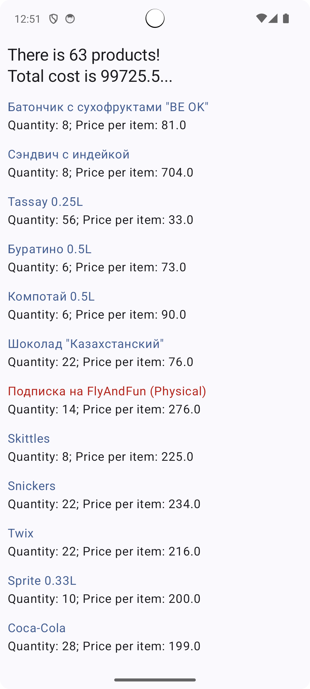

## Тестовое задание для Android программиста


#### Аннотация
Данное тестовое задание предназначено для оценки навыков кандидата в
работе с API, структурированием данных и созданием клиентского приложения
для взаимодействия с этими данными на платформе Android. Задание
включает три этапа, направленных на проверку знаний сетевых операций,
работы с базами данных и реализации пользовательского интерфейса.
#### Примечание
На выполнение задания дается 3-5 дней. Пожалуйста, задавайте вопросы и
уточняйте детали, если это необходимо.
#### Внимание
Не допускается использование фреймворков и готовых библиотек, за
некоторым исключением, о которых будет явно написано.

### Таск 1
**Задача**: написать простенький клиент для работы с предоставленным api, не
прибегая к готовым сторонним решениям, а ля retrofit, volley и т.п
Исключение: допускается подтянуть json/xml парсер, если таковой остутсвует в
стандартной библиотеке.
**Дано**: тестовое API по адресу https://testpos.api.skydepot.io/
Зная доступные методы API (приведены ниже), реализовать клиент, который
будет способен дергать методы API.
В заголовке каждого запроса ожидается два обязательных параметра:
- rts - request time stamp, используется для воссоздания apikey при проверке
- authorization - сам токен, сгенерированный клиентом по заранее
определенному алгоритму с привязкой к rts. Врем жизни ключа rts +5 минут.
Если разница между rts и системным временем сервера >5 минут в большую
или меньшую сторону, то ключ не пройдёт проверку и запрос будет отклонён:

#### Алгоритм генерации ключа, реализация на php:
```php
/*
@param rts - временная метка, переданная в запросе.
результатом выполнения genkey является конкатенация строк: шифрованный ключ +
шифрованная фраза + шифрованный вектор инициализации если
$header["authorization"]!==genkey($header["rts"]) - запрос отклоняется.
*/
public static function genkey(?int $rts = null): string
{
date_default_timezone_set('UTC');
$ctime = date("Y-m-d H:i:s", $rts);
$cryptor = new Cryptor();
$sourceA = sprintf("%sTEST%sTASK%s", (ord($ctime[13]) + 1) *
(ord($ctime[15]) + 1), substr($ctime, 0, 17), substr($ctime, 0, 17));
$sourceB = sprintf("DOIT%sPLS%s%s", substr($ctime, 12, 5),
substr($ctime, 12, 5), (ord($ctime[13]) + 1) * (ord($ctime[15]) + 3));
$key = strtoupper(substr(hash("sha512", $sourceA), 0, 32));
$iv = strtoupper(substr(hash("sha512", $sourceB), 16, 16));
$cryptor->updateKey($key);
$cryptor->updateIV($iv);
$apikey = sprintf("%s%s%s", trim($cryptor->encrypt($key)),
trim($cryptor->encrypt("justfortesttask")), trim($cryptor->encrypt($iv)));
return $apikey;
}
```

#### Реализация Cryptor на php:
```php
class Cryptor
{
public static $method = 'aes-256-cbc';
private $instanceKey = "";
private $instanceIv = "";
public function updateIV(String $newIv)
{
$this->instanceIv = $newIv;
}
public function updateKey(String $newKey)
{
$this->instanceKey = $newKey;
}
public function encrypt($string)
{
return base64_encode(openssl_encrypt($string, self::$method, $this-
>instanceKey, true, $this->instanceIv));
}
public function decrypt($encrypted)
{
return openssl_decrypt($encrypted, self::$method, $this->instanceKey,
true, $this->instanceIv);
}
}
```

#### Пример JSON-RPC запроса tripsShow():
```
{
   "jsonrpc" : "2.0",
   "method" : "trips.show",
   "params" : {
      "id": "10",
      "company": "wa"
   },
   "id":1
}
```

#### Более детальный пример:
```bash
curl -X POST https://testpos.api.skydepot.io/ \
   -H 'Content-Type: application/json' \
   -H 'authorization: l/QcI32yOr9j8oRnYuTnl8mi7rAec/4UPbfW9DiXvNx49MlNeI9GgF+G6xkGeesRbR+WHDdvAnb9900EeyrNhQ==T0VHlwI3yliYU0/lJVFsUioNPb7NNbeTOQB20zmkY7c=' \
   -H 'rts: 1695987703' \
   -d '{
   "jsonrpc" : "2.0",
   "method" : "trips.show",
   "params" : {
      "id": "10",
      "company": "wa"
   },
   "id":1
}'
```

#### Список методов API и требуемых параметров запроса:
Если требуется `pos_id`, можно использовать 1,19,105.
`trip_id` для тестов: 10
`company`:`wa`
```
"getConfig" => "company" // получить конфиг для клиентской приложухи наконкретную компанию.
"getCurrencies" => "company" // Вернет валюты
"trips.show" => "id", "company" // id - идентификатор трипа, данные непосредственно по трипу: предзаказы, сколько продуктов загружено, сколько секторов, на каком секторе какой борт, и т.п
"getDiscounts" => "company" // получение скидок
"getSeatMap" => "company", "planes_ids" // получение карты рассадки
"getGoodsTaxes" => "company" //налоги по товарам, к товарам могут быть применены разные налоги.
"getMerchants" => "company" // список мерчантов(компании на кого будут записываться продажи)
"getTblPaginated" => "company", "tblName", "offset", "limit" //может быть нужно для получение чего-то большого
"getDicts" => "company" // когда-то базовые данные, типа валюты, страны и т.п
"getPlanes" => "company", "trip_id", "pos_id" // данные о самолётах, нужно для seatmaps
"getBarcodes" => "company" // содержит штрихкоды продуктов
```

### Таск 2
**Задача**: после выполнения первого таска, у нас есть простая реализация
клиента, глядя на данные в ответах, реализовать структуры данных для
дальнейшего хранения и использования, не прибегая к чужим оберткам
(допускается своя реализация) для работы с БД (room, и т.п), используя
стандартные средства языка/SDK + коннекторы для выбранной БД.

### Таск 3
**Задача**: Получая и сохраняя данные по трипу, нужно реализовать какое-то
взаимодействие с получаемыми данными. Например: отображение списка
товаров/продуктов с их стоимостью, отображение информации о выбранном
трипе.
